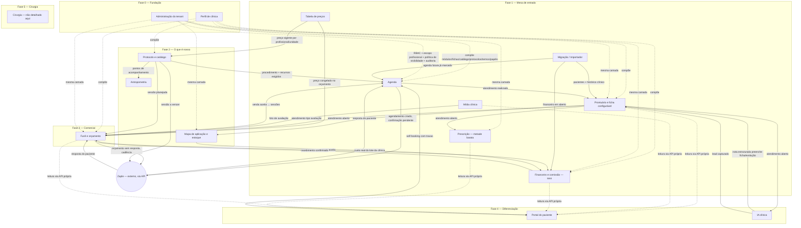

# Hello Doctor — Catálogo de Módulos e Funcionalidades

## Status

Este catálogo incorpora o **workshop de domínio de 30/08/2026** com Davi Torres — cirurgião-dentista, ex-consultor de clínicas, com clientes no nicho — registrado na seção 11 do spec de arquitetura (35 achados, origem `[Davi]`). **Onde a seção 11 fala, ela é fato e tem precedência sobre benchmark e sobre qualquer inferência anterior deste documento.** A versão anterior deste catálogo (mesma data, antes do workshop) tratava o domínio como hipótese; esta não trata mais — o domínio veio do especialista, não de benchmark nem de suposição.

O que **continua sendo síntese de produto**, não fato extraído do dono: nomes de tela, IDs de evento, formato exato de payload de integração, e a ordenação fina de campo em formulário. Isso é inferência razoável em cima de regra validada — está marcado `[inferência]` onde a distinção importa, e sem marca onde é decorrência direta e não ambígua de uma regra `[Davi]`.

**O que ainda não está validado:**
- Não existe clínica piloto usando o sistema (spec, seção 9, risco #1 — segue crítico).
- O formato de "evolução assistida" por IA (comparação de fotos vs. sumarização textual) está em aberto — seção 11.15 do spec pede confirmação no workshop de IA.
- A matriz de escopo profissional (seção 5 abaixo) é referência inicial a validar juridicamente, não regra travada em código.

**Convenção de origem usada no texto:** `[Davi]` = fato extraído no workshop (seção 11 do spec). `[benchmark]` = achado do benchmark competitivo (seção 2 do spec). Sem marca = síntese de produto direta, não ambígua, sobre uma dessas duas fontes.

---

**Data:** 2026-08-30 (reescrita pós-workshop)
**Fonte canônica:** `docs/superpowers/specs/2026-08-30-hello-doctor-arquitetura-design.md` (666 linhas, seção 11 nova) — este documento não contradiz o spec, apenas o desdobra em superfície de produto
**Nível:** superfície. O detalhamento fino (campos, regras de validação, estados de erro, critérios de aceite) de cada módulo sai em workshop dedicado com o dono
**Próximo passo:** clínica piloto (bloqueio maior do projeto) + workshop de IA (formato de evolução assistida) → PRD detalhado → design system → plano de construção

---

## Como ler este documento

- Cada funcionalidade tem um **ID estável** (`AGD-01`, `PRT-03`...) para o plano de construção referenciar depois. IDs não mudam mesmo que a redação da funcionalidade mude.
- "Entidades do domínio" lista só as tabelas que o módulo **possui**. Uma entidade referenciada por FK mas possuída por outro módulo não é repetida.
- "Fase" segue a tabela de fases do spec (seção 8, agora com 6 fases, 0 a 5). Quando um módulo entra raso numa fase e aprofunda depois, isso está anotado.
- Regra de negócio relevante cita a origem inline: `[Davi 11.N]` remete ao achado específico do workshop.

---

## 1. Mapa geral

16 módulos. 15 detalhados neste catálogo; **Cirurgia** é fase 5 e aparece como módulo declarado, sem detalhamento — `[Davi 11.18]` fixou que só é aberto depois do núcleo validado com clínica real.

**Leitura do diagrama:** setas sólidas são escrita/evento entre módulos internos. Setas tracejadas são leitura ou composição. `ADM` e `PFL` não emitem evento de negócio — são as duas camadas transversais que todo módulo consulta (identidade/permissão/auditoria e composição por perfil, respectivamente), nascidas as duas na fase 0 `[Davi 11.5, 11.16]`.

---

## 2. Módulos

### 2.1 Agenda — `AGD`

**Propósito:** ser o escalonador dos três recursos escassos da clínica — profissional, sala e equipamento — não uma agenda de pessoa `[Davi 11.8]`.

**Entidades do domínio:** `agendamento`, `sala`, `equipamento`, `bloqueio`, `horario_trabalho`

O que mudou: `agendamento` reserva **profissional + sala + equipamento(s)** simultaneamente, e a detecção de conflito roda sobre os três `[Davi 11.8]`. `procedimento` (módulo Protocolo e catálogo) declara quais recursos exige. Isto tornou a Agenda **o componente mais caro da fase 1**, não uma peça simples `[Davi 11.8, 11.20]`.

**Funcionalidades:**
- `AGD-01` Criar agendamento reservando profissional + sala + equipamento(s) simultaneamente `[Davi 11.8]`
- `AGD-02` Detectar conflito de horário sobre os três recursos, não só sobre o profissional `[Davi 11.8]`
- `AGD-03` Visão "dia por profissional" (colunas) — a mais usada, hora a hora `[Davi 11.20]`
- `AGD-04` Visão "dia por sala e por equipamento" — enxerga o gargalo físico `[Davi 11.20]`
- `AGD-05` Visão "semana de um profissional" `[Davi 11.20]`
- `AGD-06` Visão "mês com ocupação" — densidade, dias fracos, planejamento de campanha `[Davi 11.20]`
- `AGD-07` Bloquear horário (folga, almoço, manutenção de sala/equipamento)
- `AGD-08` Configurar horário de trabalho por profissional/unidade, respeitando horário próprio quando o vínculo é parceiro/aluguel `[Davi 11.1]`
- `AGD-09` Confirmar, remarcar ou cancelar agendamento, com motivo
- `AGD-10` Marcar status de comparecimento (agendado, confirmado, atendido, faltou, cancelado) — alimenta a taxa de no-show como métrica de primeira classe `[Davi 11.14]`
- `AGD-11` Bloquear criação de agendamento se o profissional não tem escopo para o procedimento (consulta `ADM`)
- `AGD-12` Sugerir horário livre cruzando disponibilidade de profissional + sala + equipamento
- `AGD-13` Receber solicitação de self-booking do Portal e validar as quatro travas antes de confirmar `[Davi 11.33]`

**Telas:**
- Dia por profissional — grade em colunas
- Dia por sala e equipamento — visão de recurso físico
- Semana do profissional
- Mês com ocupação — visão de gestão
- Novo agendamento — busca de paciente + procedimento/sessão + recurso triplo
- Detalhe do agendamento — histórico de status
- Cadastro de equipamento e sala

**Integrações consumidas:** Zaple (confirmação por WhatsApp)

**Eventos:**
- Emite: `agenda.agendamento_criado`, `agenda.confirmacao_pendente`, `agenda.status_alterado`, `agenda.conflito_detectado`
- Consome: `zaple.resposta_paciente`, `catalogo.sessao_planejada_criada`, `funil.venda_criada` (sessões a agendar), `portal.self_booking_solicitado`

**Fase:** 1 `[Davi 11.19]` — a fase 1 deixou de ser "vertical fina" e virou "mesa de entrada": sem agenda de recurso triplo de verdade, nenhuma clínica troca de sistema.

---

### 2.2 Prontuário e ficha configurável — `PRT`

**Propósito:** ser o núcleo clínico tipado — paciente (com estágio), atendimento, ficha por especialidade e evolução — onde vivem relatório, gráfico, IA e auditoria.

**Entidades do domínio:** `paciente` (com `estagio` e origem de captação), `atendimento`, `ficha`, `ficha_template`, `ficha_template_versao`, `evolucao`, `exame_anexo`

O que mudou: **não existe cadastro de lead separado.** Quem entra em contato já nasce `paciente` em estágio `lead`, e ganha histórico único desde o primeiro toque `[Davi 11.23]`. O atendimento tipo avaliação é ao mesmo tempo prontuário e degrau do funil `[Davi 11.24]`. Um paciente pode ter **vários protocolos ativos em paralelo** — não existe "o plano do paciente" `[Davi 11.9]`. Exame vira anexo, não valor estruturado `[Davi 11.17]`.

**Funcionalidades:**
- `PRT-01` Cadastrar paciente/lead com nome, contato e origem da captação — nasce em estágio `lead` `[Davi 11.23]`
- `PRT-02` Evoluir estágio do paciente: lead → avaliado → em tratamento → inativo `[Davi 11.23]`
- `PRT-03` Abrir atendimento (avulso ou vinculado a sessão planejada); atendimento tipo avaliação é simultaneamente prontuário e degrau do funil `[Davi 11.24]`
- `PRT-04` Preencher ficha de anamnese/avaliação usando o template versionado da especialidade
- `PRT-05` Registrar evolução do atendimento
- `PRT-06` Criar e versionar `ficha_template` por especialidade (JSON Schema), sem deploy
- `PRT-07` Anexar exame vinculado a tipo de exame + data de coleta, sem extração de valor `[Davi 11.17]`
- `PRT-08` Exibir múltiplos protocolos/planos ativos em paralelo, cada um com linha do tempo e aderência próprias — nunca "o plano do paciente" `[Davi 11.9]`
- `PRT-09` Filtrar por padrão o estágio `lead` fora das telas clínicas — só funil e busca comercial enxergam lead `[Davi 11.23]`
- `PRT-10` Aplicar a política de visibilidade de paciente da clínica (isolado/aberto/restrito) em toda consulta de paciente/ficha/evolução `[Davi 11.5]`
- `PRT-11` Registrar automaticamente evento de auditoria em toda leitura de prontuário

**Telas:**
- Ficha do paciente — cadastro, estágio, atalhos para todos os módulos clínicos e comerciais
- Anamnese/avaliação — formulário por JSON Schema da especialidade
- Evolução do atendimento
- Painel de planos — múltiplos protocolos ativos, lado a lado
- Exames anexados — por tipo e data
- Timeline clínica consolidada
- Editor de template de ficha (uso administrativo)

**Integrações consumidas:** nenhuma externa direta; recebe nota estruturada da IA clínica

**Eventos:**
- Emite: `prontuario.paciente_criado`, `prontuario.estagio_alterado`, `prontuario.atendimento_criado`, `prontuario.evolucao_registrada`, `prontuario.ficha_preenchida`, `prontuario.exame_anexado`, `prontuario.leitura_registrada`
- Consome: `ia_clinica.nota_estruturada_gerada`, `agenda.status_alterado`

**Fase:** 1 — núcleo da mesa de entrada `[Davi 11.19]`

---

### 2.3 Mídia clínica — `MID`

**Propósito:** capturar foto com padronização na hora da captura, por dois caminhos possíveis, para permitir comparação confiável entre sessões.

**Entidades do domínio:** `foto`, `pose`

O que mudou: o equipamento de captura varia por clínica (celular do profissional, tablet, câmera dedicada), então o sistema precisa de **captura direta** e **importação de arquivo**, com o mesmo pareamento paciente+pose nos dois caminhos `[Davi 11.12]`. Existe risco de LGPD quando a foto passa pela galeria pessoal do profissional antes de chegar ao sistema `[Davi 11.12]`.

**Funcionalidades:**
- `MID-01` Capturar foto direto pelo PWA com guia de pose sobreposto à câmera `[Davi 11.12]`
- `MID-02` Importar arquivo de foto (celular pessoal, tablet, câmera dedicada), com o mesmo pareamento paciente+pose da captura direta `[Davi 11.12]`
- `MID-03` Gravar a foto capturada direto no sistema, sem passar pela galeria do dispositivo `[Davi 11.12]`
- `MID-04` Alinhar automaticamente a foto nova sobre a anterior da mesma pose
- `MID-05` Vincular foto ao atendimento/sessão específica, nunca ao paciente em geral
- `MID-06` Cadastrar/editar `pose` (guia de enquadramento por especialidade/região)
- `MID-07` Exibir comparativo antes/depois por pose
- `MID-08` Aplicar consentimento por finalidade e âncora à foto (ver seção 5 do spec, achado `[Davi 11.10]`)

**Telas:**
- Captura guiada — câmera com overlay de pose
- Importar foto — upload com pareamento paciente+pose
- Galeria do paciente
- Comparativo antes/depois
- Gestão de poses

**Integrações consumidas:** storage S3-compatível com URLs assinadas; provedor de assinatura eletrônica (consentimento de imagem)

**Eventos:**
- Emite: `midia.foto_capturada`, `midia.foto_importada`, `midia.consentimento_imagem_revogado`
- Consome: `prontuario.atendimento_criado`

**Fase:** 1

---

### 2.4 Protocolo e catálogo — `CAT`

**Propósito:** definir o que a clínica vende (procedimento) e permitir que **cada clínica construa seus próprios protocolos** de múltiplas sessões, com aderência ao intervalo — não catálogo pronto de fábrica.

**Entidades do domínio:** `procedimento`, `protocolo_template`, `protocolo_instancia`, `sessao_planejada`

O que mudou: não entregamos protocolo pronto. `protocolo_template` é editável pela clínica e define sessões, intervalos, **os pontos de acompanhamento e quais medidas coletar em cada um**, e quem participa de cada etapa `[Davi 11.11]`. Existe um editor de protocolo como funcionalidade de produto — o acompanhamento é configuração de template, nunca regra fixa no código.

**Funcionalidades:**
- `CAT-01` Cadastrar procedimento (nome, duração, insumos previstos, conselhos autorizados, recursos exigidos); preço vem da Tabela de preços, não deste módulo
- `CAT-02` Editor de protocolo template pela própria clínica: sessões, procedimentos, ordem e intervalo esperado (mínimo/ideal/máximo) `[Davi 11.11]`
- `CAT-03` Definir pontos de acompanhamento e quais medidas coletar em cada etapa do template `[Davi 11.11]`
- `CAT-04` Definir quem participa de cada etapa do protocolo `[Davi 11.11]`
- `CAT-05` Iniciar instância de protocolo para um paciente; um paciente pode ter múltiplos protocolos ativos ao mesmo tempo `[Davi 11.9]`
- `CAT-06` Acompanhar aderência ao intervalo por sessão planejada, por protocolo — não existe saldo único de "sessões restantes do paciente"
- `CAT-07` Registrar avulso usando o procedimento do catálogo, sem envelope de pacote
- `CAT-08` Alertar sessão a vencer (fora do intervalo ideal)

**Telas:**
- Catálogo de procedimentos
- Editor de protocolo template — sessões, intervalos, pontos de acompanhamento, participantes
- Painel de planos do paciente — múltiplos protocolos em paralelo
- Painel de aderência

**Integrações consumidas:** nenhuma externa direta

**Eventos:**
- Emite: `catalogo.protocolo_iniciado`, `catalogo.sessao_planejada_criada`, `catalogo.sessao_a_vencer`, `catalogo.ponto_acompanhamento_atingido`
- Consome: `agenda.status_alterado`, `tabela_precos.preco_alterado`

**Fase:** 2 (protocolo multi-sessão com editor e aderência). O cadastro básico de `procedimento` entra raso na fase 1, como dependência direta da Agenda e da Tabela de preços — ver risco na seção final.

---

### 2.5 Mapa de aplicação e estoque — `MAP`

**Propósito:** registrar no mapa anatômico o que foi aplicado, com lote real e proprietário real — sem obrigar o registro em tempo real e sem esconder a divergência de estoque que isso gera.

**Entidades do domínio:** `aplicacao`, `mapa`, `mapa_regiao`, `produto`, `lote`, `movimento_estoque`

O que mudou, e é a correção mais profunda do workshop: **o registro da aplicação não é obrigatório no momento do atendimento** `[Davi 11.3]`. `aplicacao` tem duas datas — `ocorrido_em` e `registrado_em`, ambas auditadas. Atendimento sem registro gera **pendência, não bloqueio**, numa fila por profissional. O estoque expõe saldo contábil, consumo pendente e saldo projetado — nunca finge saldo fechado. Além disso, `produto` declara modo de controle (fracionado ou unitário) `[Davi 11.27]`, o sistema **não** rastreia estado de frasco aberto `[Davi 11.28]`, e `lote` tem **proprietário** — clínica ou profissional específico, porque insumo próprio e da clínica convivem `[Davi 11.6]`.

**Funcionalidades:**
- `MAP-01` Marcar ponto de aplicação no mapa, com região, lote e quantidade
- `MAP-02` Registrar aplicação com `ocorrido_em` e `registrado_em` distintos, sem exigir lançamento em tempo real `[Davi 11.3]`
- `MAP-03` Fila de "atendimentos aguardando registro de aplicação" por profissional — pendência, não bloqueio `[Davi 11.3]`
- `MAP-04` Baixar estoque automaticamente a partir da aplicação registrada — não existe tela separada de "dar baixa"
- `MAP-05` Exibir saldo contábil, consumo pendente de lançamento e saldo projetado, sem fingir saldo fechado `[Davi 11.3]`
- `MAP-06` Permitir registro retroativo de aplicação, sempre auditado
- `MAP-07` Cadastrar produto com modo de controle: fracionado (saldo em UI/ml) ou unitário (saldo em peças) `[Davi 11.27]`
- `MAP-08` Cadastrar lote com proprietário: clínica (padrão) ou profissional específico `[Davi 11.6]`
- `MAP-09` Direcionar alerta de vencimento para o dono do lote, clínica ou profissional `[Davi 11.6]`
- `MAP-10` Só computar o custo do procedimento no resultado da clínica quando o lote usado é da clínica `[Davi 11.6]`
- `MAP-11` Alertar vencimento de lote com sugestão de substituto disponível
- `MAP-12` Registrar entrada de estoque (compra), com segregação entre quem lança e quem confere **configurável por clínica**, não obrigatória `[Davi 11.29]` — diferente da segregação venda/recebimento (ver `FIN-04`), que é obrigatória
- `MAP-13` Consultar movimento de estoque com origem rastreável até a aplicação
- `MAP-14` Iniciar inventário do zero por contagem física no onboarding — importação de saldo é opção, nunca pré-requisito `[Davi 11.30]`

**Telas:**
- Mapa de aplicação — face/corpo interativo
- Fila de registro pendente
- Estoque de produtos — saldo contábil / pendente / projetado
- Lotes a vencer, por dono
- Movimentação de estoque
- Entrada de estoque
- Inventário físico inicial

**Integrações consumidas:** nenhuma externa direta

**Eventos:**
- Emite: `mapa.aplicacao_registrada`, `mapa.aplicacao_pendente`, `estoque.lote_baixo`, `estoque.lote_a_vencer`
- Consome: `prontuario.atendimento_criado`

**Fase:** 2

---

### 2.6 Antropometria — `ANT`

**Propósito:** registrar medida como série temporal, dirigida pelos pontos de acompanhamento que cada protocolo definir.

**Entidades do domínio:** `medida`

O que mudou: quais medidas coletar em cada etapa não é fixo no produto — vem do `protocolo_template` que a clínica configurou `[Davi 11.11]`.

**Funcionalidades:**
- `ANT-01` Registrar medida (peso, cintura, quadril, percentual de gordura, pressão) vinculada ao atendimento
- `ANT-02` Exibir gráfico de progressão por tipo de medida
- `ANT-03` Comparar período (ex.: início do protocolo vs. hoje)
- `ANT-04` Sugerir quais medidas coletar no atendimento, a partir do ponto de acompanhamento do protocolo ativo `[Davi 11.11]`

**Telas:**
- Registro de medida
- Gráfico de evolução
- Comparativo de período

**Integrações consumidas:** nenhuma externa direta

**Eventos:**
- Emite: `antropometria.medida_registrada`
- Consome: `prontuario.atendimento_criado`, `catalogo.ponto_acompanhamento_atingido`

**Fase:** 2

---

### 2.7 Funil e orçamento — `FUN`

**Propósito:** acompanhar a jornada comercial inteira — captação → agendamentos → comparecimentos → conversão — rodando sobre `paciente`/`atendimento`/`orçamento`, entidades que já existem, sem pipeline paralelo.

**Entidades do domínio:** `orcamento`, `venda`, `saldo_sessao`, `cadencia_followup`

O que mudou é a simplificação mais importante do workshop: **não existe `lead` nem `oportunidade` como tabela própria** `[Davi 11.23, 11.24]`. `paciente.estagio` e `atendimento` são possuídos pelo Prontuário e apenas consumidos aqui. O dono do orçamento varia por porte: em clínica pequena o profissional avalia, orça e fecha; a partir de certo porte entra consultora comercial dedicada, e o funil precisa funcionar idêntico com ou sem ela `[Davi 11.2]`. A avaliação tem três modelos de cobrança `[Davi 11.25]`. O follow-up de orçamento é cadência configurável e medida `[Davi 11.26]`.

**Funcionalidades:**
- `FUN-01` Exibir o funil completo — captação → agendamentos → comparecimentos → conversão — sobre `paciente.estagio` + status do agendamento + venda `[Davi 11.14, 11.24]`
- `FUN-02` Criar orçamento a partir de atendimento tipo avaliação, com múltiplas opções (A/B/C) e preço congelado no momento da emissão `[Davi 11.21]`
- `FUN-03` Anexar foto de avaliação ao orçamento
- `FUN-04` Aceitar orçamento → gerar venda com composição congelada
- `FUN-05` Gerar `saldo_sessao` a partir de venda tipo pacote fechado `[Davi 11.4]`
- `FUN-06` Bloquear agendamento/consumo de sessão sem saldo disponível (trava dura)
- `FUN-07` Registrar avaliação gratuita, cobrada ou cobrada-com-abatimento, gerando crédito de abatimento quando aplicável `[Davi 11.25]`
- `FUN-08` Configurar cadência de follow-up de orçamento por clínica (contato em X dias, depois em Y) `[Davi 11.26]`
- `FUN-09` Gerar fila diária de "quem contatar hoje" e medir aderência à cadência `[Davi 11.26]`
- `FUN-10` Atribuir consultora comercial (opcional) ao orçamento, com comissão de venda independente da comissão de execução `[Davi 11.2]`
- `FUN-11` Medir taxa de comparecimento (no-show) por degrau do funil, como métrica de primeira classe `[Davi 11.14]`
- `FUN-12` Consultar saldo de sessões por paciente/procedimento

**Telas:**
- Funil — jornada completa com taxa de conversão por degrau
- Orçamento — opções A/B/C, foto anexada, preço congelado
- Detalhe da venda
- Fila de follow-up de orçamento
- Configuração de cadência
- Saldo do paciente

**Integrações consumidas:** Zaple (follow-up via WhatsApp)

**Eventos:**
- Emite: `funil.orcamento_criado`, `funil.orcamento_sem_resposta`, `funil.venda_criada`, `funil.saldo_atualizado`, `funil.followup_pendente`
- Consome: `midia.foto_capturada`, `prontuario.estagio_alterado`, `prontuario.atendimento_criado`, `agenda.status_alterado`, `zaple.resposta_paciente`, `ia_clinica.lead_capturado`, `tabela_precos.preco_alterado`

**Fase:** 3

---

### 2.8 Financeiro e comissão — `FIN`

**Propósito:** controlar título, parcela, recebimento e comissão para os quatro modelos de venda que convivem no nicho, com um motor de regras de comissão configurável e a segregação venda/recebimento que continua sendo obrigatória.

**Entidades do domínio:** `titulo`, `parcela`, `recebimento`, `comissao`, `movimento_caixa`, `carteira_credito`, `assinatura_recorrente`

O que mudou: pacote fechado, avulso, mensalidade/assinatura e crédito pré-pago são quatro mecânicas financeiras distintas que convivem, decididas para entrar **juntas na fase 3** — decisão que assume que a fase 3 provavelmente dobra de tamanho `[Davi 11.4]`. Comissão deixou de ser campo e virou **motor de regras**: base (bruto, líquido, fixo, escalonado) × condição (vínculo, meta, procedimento) × vigência, configurável por clínica e por profissional `[Davi 11.13]`. Comissão sobre o líquido amarra o cálculo ao custo real do lote — o que torna o registro de aplicação (`MAP-02`) um incentivo financeiro direto, não só burocracia clínica `[Davi 11.13]`.

**Funcionalidades:**
- `FIN-01` Gerar título e parcelas a partir de venda tipo pacote fechado ou avulso `[Davi 11.4]`
- `FIN-02` Gerenciar assinatura/mensalidade recorrente: cobrança periódica, falha de cartão, dunning, suspensão e reativação `[Davi 11.4]`
- `FIN-03` Gerenciar carteira de crédito pré-pago em reais, abatida em qualquer procedimento no consumo `[Davi 11.4]`
- `FIN-04` Confirmar recebimento — ação restrita a papel diferente de quem registrou a venda; segregação **obrigatória**, não configurável, por ser exposição a fraude interna
- `FIN-05` Motor de regra de comissão: base × condição × vigência, configurável por clínica e por profissional `[Davi 11.13]`
- `FIN-06` Calcular comissão sobre o líquido usando o custo real do lote efetivamente aplicado `[Davi 11.13]`
- `FIN-07` Calcular comissão por vínculo do profissional — percentual (CLT), repasse (PJ/parceiro) ou aluguel fixo (sala) `[Davi 11.1]`
- `FIN-08` Emitir NFS-e a partir do recebimento
- `FIN-09` Consultar movimento de caixa
- `FIN-10` Auditar todo ato de registro de venda e de confirmação de recebimento, com os dois nomes visíveis

**Telas:**
- Títulos a receber
- Assinaturas recorrentes — com fila de falha de cobrança
- Carteira de crédito do paciente
- Confirmação de recebimento (papel restrito)
- Motor de comissão — regras por clínica/profissional
- Comissão por profissional
- Caixa

**Integrações consumidas:** gateway de pagamento (PIX, cartão recorrente, boleto), integração de NFS-e

**Eventos:**
- Emite: `financeiro.titulo_gerado`, `financeiro.recebimento_confirmado`, `financeiro.comissao_calculada`, `financeiro.cobranca_recorrente_falhou`, `financeiro.credito_debitado`
- Consome: `funil.venda_criada`, `mapa.aplicacao_registrada`, `migracao.lote_importado` (financeiro em aberto)

**Fase:** 1, raso — só recebimento simples de atendimento avulso, para fechar o marco da mesa de entrada. Aprofunda inteiro na fase 3, onde os quatro modelos de venda entram juntos `[Davi 11.4]`.

---

### 2.9 Prescrição — `PRE`

**Propósito:** ser mesa de entrada, não diferencial — o médico prescreve todo dia, e a metade barata do produto já entrega valor sem depender de integração cara.

**Entidades do domínio:** `prescricao`, `medicamento_favorito`, `modelo_posologia`

O que mudou: prescrição sobe para a **fase 1**, dividida em duas metades `[Davi 11.22]`. A metade barata é base de medicações pronta + favoritos da clínica + modelo de posologia editável no ato, com receita em PDF impressa e assinada no papel. A metade cara — assinatura digital ICP-Brasil e receita controlada via Memed — fica na fase 4, por causa de homologação, custo por receita e dependência de terceiro.

**Funcionalidades:**
- `PRE-01` Base de medicações pronta com cobertura ampla `[Davi 11.22]`
- `PRE-02` Marcar favoritos da clínica a partir da base, formando lista curta `[Davi 11.22]`
- `PRE-03` Cadastrar modelo de posologia padronizado pela clínica `[Davi 11.22]`
- `PRE-04` Editar posologia no ato da prescrição sem alterar o modelo original `[Davi 11.22]`
- `PRE-05` Gerar receita em PDF para impressão e assinatura no papel `[Davi 11.22]`
- `PRE-06` Bloquear prescrição fora do escopo do conselho do profissional; prescrição controlada é exclusiva de CRM (ver seção 5)
- `PRE-07` Assinatura digital ICP-Brasil via Memed `[Davi 11.22, fase 4]`
- `PRE-08` Emitir receita controlada (GLP-1, sibutramina) via Memed `[Davi 11.22, fase 4]`
- `PRE-09` Consultar histórico de prescrições do paciente

**Telas:**
- Nova prescrição — base + favoritos + modelo de posologia editável
- Gestão de favoritos e modelos de posologia (clínica)
- Histórico de prescrições

**Integrações consumidas:** Memed (só na metade cara, fase 4 — assinatura ICP-Brasil e controlados); base de medicação da metade barata pode ser fonte própria ou de terceiro, a decidir no workshop de prescrição

**Eventos:**
- Emite: `prescricao.emitida`, `prescricao.assinada_digitalmente` (fase 4)
- Consome: `prontuario.atendimento_criado`

**Fase:** 1 (metade barata: base + favoritos + modelo + PDF impresso) e 4 (metade cara: ICP-Brasil + controlados via Memed) `[Davi 11.22]`

---

### 2.10 Portal do paciente — `POR`

**Propósito:** entregar self-service ao paciente nas quatro frentes que reduzem trabalho administrativo e retêm — com travas obrigatórias no self-booking, dada a complexidade da agenda deste produto.

**Entidades do domínio:** nenhuma entidade clínica nova; exige autenticação própria do paciente, fora do RBAC de `membro` — desenho de credencial fica para o workshop.

O que mudou: o Portal tinha sete funcionalidades no catálogo anterior; agora são exatamente **quatro**, com pesos explícitos do dono `[Davi 11.33]`, e o self-booking carrega quatro travas específicas.

**Funcionalidades:**
- `POR-01` Preencher ficha e assinar termos antes da consulta — o que mais reduz trabalho administrativo, libera a recepção no dia `[Davi 11.33]`
- `POR-02` Ver evolução: fotos, peso, medidas — retenção pura `[Davi 11.33]`
- `POR-03` Ver saldo de pacote e próximas sessões — elimina a pergunta que mais chega por WhatsApp na recepção `[Davi 11.33]`
- `POR-04` Agendar e remarcar sozinho (self-booking), respeitando quatro travas obrigatórias `[Davi 11.33]`:
  - disponibilidade simultânea de profissional + sala + equipamento (`AGD-01`/`11.8`)
  - intervalo mínimo do protocolo (`11.9`)
  - trava dura de saldo (`FUN-06`)
  - escopo profissional do procedimento

**Telas:**
- Início do portal
- Ficha e termos pré-consulta
- Minha evolução
- Meu saldo e próximas sessões
- Agendar/remarcar

**Integrações consumidas:** provedor de assinatura eletrônica

**Eventos:**
- Emite: `portal.ficha_preenchida`, `portal.consentimento_assinado`, `portal.self_booking_solicitado`
- Consome (leitura direta via API própria, não evento): `PRT`, `MID`, `FIN`, `FUN`, `AGD`, `CAT`

**Fase:** 4 — depende de Agenda de recurso triplo (fase 1), saldo (fase 3) e escopo profissional (fase 0), todos já maduros quando o Portal chega.

---

### 2.11 IA clínica — `IAC`

**Propósito:** aplicar IA onde há receita comprovada no nicho, na ordem de prioridade que o dono definiu — não a ordem que pareceria óbvia de fora.

**Entidades do domínio:** nenhuma tabela formalmente modelada no spec; desenho de dado sai no workshop de IA. Descrito aqui por **função**, não por schema.

O que mudou: a ordem de prioridade é explícita e vem do dono `[Davi 11.15]`: **1) simulação visual**, usada na avaliação; **2) transcrição que preenche o prontuário estruturado** (não gera texto solto — popula ficha e evolução); **3) evolução assistida**, cujo formato (comparação de fotos vs. sumarização textual) ainda está em aberto para o workshop de IA.

**Funcionalidades:**
- `IAC-01` Simulação visual de resultado a partir de foto, usada na avaliação `[Davi 11.15, prioridade 1]`
- `IAC-02` Capturar contato do lead antes de mostrar o resultado da simulação (regra dura, spec seção 8)
- `IAC-03` Gravar consulta com consentimento próprio apresentado no momento
- `IAC-04` Transcrever a gravação (PT-BR)
- `IAC-05` Preencher campos estruturados da ficha e a evolução clínica a partir da transcrição, para revisão do profissional antes de confirmar `[Davi 11.15, prioridade 2]`
- `IAC-06` Evolução assistida — formato (comparação de fotos ou sumarização textual) a confirmar no workshop de IA `[Davi 11.15, prioridade 3, em aberto]`

**Telas:**
- Simulador visual
- Gravação de consulta
- Revisão de preenchimento estruturado (antes de aceitar)
- Evolução assistida (formato a definir)

**Integrações consumidas:** AssemblyAI (transcrição PT-BR), serviço gerenciado de jobs assíncronos

**Eventos:**
- Emite: `ia_clinica.lead_capturado`, `ia_clinica.nota_estruturada_gerada`
- Consome: `prontuario.atendimento_criado`

**Fase:** 4. Ordem interna de prioridade do dono é regra de produto, não só de engenharia `[Davi 11.15]`.

---

### 2.12 Perfil de clínica — `PFL` (novo módulo)

**Propósito:** compor, por clínica, quais módulos, fichas, catálogos, protocolos e termos ficam ativos — o produto atende perfis de operação muito diferentes dentro do mesmo nicho, e a lista de perfis é **aberta por definição** `[Davi 11.16]`.

**Entidades do domínio:** `perfil_clinica`

O que motivou este módulo: harmonização e injetáveis, emagrecimento, estética com aparelho e cirurgia plástica têm centros de gravidade diferentes — e "mais outros", confirmados pelo dono `[Davi 11.16]`. **`perfil_clinica` é um objeto de configuração, nunca um enum fechado no código.** O benchmark mostrou que atender todo mundo raso (Amigo Clinic, MedX Care) é o modo padrão de falha do mercado `[benchmark]`; perfis existem para preservar profundidade.

**Funcionalidades:**
- `PFL-01` Selecionar/compor perfil no onboarding a partir de perfis de referência (harmonização e injetáveis, emagrecimento, estética com aparelho, cirurgia plástica) — lista extensível `[Davi 11.16]`
- `PFL-02` Ativar/desativar módulo por clínica conforme o perfil, com a navegação se ajustando sem espaço morto `[Davi 11.16]`
- `PFL-03` Carregar fichas de anamnese sugeridas pelo perfil
- `PFL-04` Carregar catálogo de procedimentos sugerido pelo perfil
- `PFL-05` Carregar protocolos modelo sugeridos pelo perfil
- `PFL-06` Carregar termos de consentimento sugeridos pelo perfil
- `PFL-07` Carregar papéis sugeridos pelo perfil
- `PFL-08` Editar a composição do perfil depois do onboarding — perfil não é imutável

**Telas:**
- Escolha de perfil no onboarding
- Editor de composição do perfil (módulos, fichas, catálogo, protocolos, termos, papéis)

**Integrações consumidas:** nenhuma externa

**Eventos:**
- Emite: `perfil.ativado`, `perfil.modulo_alterado`
- Consumido por: praticamente todo módulo, no boot da navegação e do onboarding

**Fase:** 0 — nasce junto com a fundação porque "enxertar depois obriga a reescrever navegação, permissão e onboarding" `[Davi 11.16]`.

---

### 2.13 Tabela de preços — `TPR` (novo módulo)

**Propósito:** ser a **política de preço**, não uma lista — preço varia por profissional, por unidade, tem vigência promocional e desconto com limite por papel `[Davi 11.21]`.

**Entidades do domínio:** `preco` (com vigência), `regra_desconto`

**Funcionalidades:**
- `TPR-01` Definir preço por procedimento × profissional que executa — o sênior cobra mais que o júnior pelo mesmo procedimento, essencial quando o parceiro define o próprio preço `[Davi 11.21, 11.1]`
- `TPR-02` Definir preço por procedimento × unidade — a mesma rede cobra diferente por praça `[Davi 11.21]`
- `TPR-03` Definir preço promocional com vigência (data de início e fim) `[Davi 11.21]`
- `TPR-04` Definir limite de desconto por papel (recepção até X%, gestora até Y%, dona sem limite) `[Davi 11.21]`
- `TPR-05` Congelar o preço aplicado no momento da emissão do orçamento — orçamento antigo nunca recalcula com preço novo `[Davi 11.21]`
- `TPR-06` Autorizar desconto no ato, contra o papel de quem aplica
- `TPR-07` Gerar relatório de quem descontou o quê `[Davi 11.21]`

**Telas:**
- Tabela de preços (por profissional/unidade)
- Promoções (vigência)
- Limites de desconto por papel
- Relatório de descontos aplicados

**Integrações consumidas:** nenhuma externa

**Eventos:**
- Emite: `tabela_precos.preco_alterado`, `tabela_precos.desconto_aplicado`
- Consumido por: `CAT-01` (preço vigente do procedimento), `FUN-02` (congelamento no orçamento)

**Fase:** 1 — spec seção 8 lista "tabela de preços com política" explicitamente na entrega da mesa de entrada.

---

### 2.14 Migração / Importador — `MIG` (novo módulo)

**Propósito:** ser o mini-produto que permite à própria clínica migrar os quatro conjuntos de dado — pacientes, agenda futura, prontuário/histórico, financeiro em aberto — sozinha, por planilha, sem serviço assistido `[Davi 11.31, 11.32]`.

**Entidades do domínio:** `importacao_lote`, `importacao_erro`

O que motivou este módulo: a clínica não aceita trocar de sistema sem migrar os quatro conjuntos `[Davi 11.31]`, mas migração assistida consome o tempo do Davi, que é o gargalo do projeto — decisão consciente de deixar a clínica importar sozinha `[Davi 11.32]`. Isso é reconhecido como **o maior risco do onboarding**: exigir os quatro conjuntos e deixar a clínica sozinha com CSV é a combinação de maior taxa de falha de implantação — por isso o esforço vai para o importador ser realmente bom, não para horas de implantação assistida.

**Funcionalidades:**
- `MIG-01` Fornecer modelo de planilha por conjunto de dado (pacientes, agenda futura, prontuário/histórico, financeiro em aberto) `[Davi 11.31]`
- `MIG-02` Pré-visualizar o que será gravado antes de gravar `[Davi 11.32]`
- `MIG-03` Validar linha a linha com mensagem de erro legível por leigo `[Davi 11.32]`
- `MIG-04` Corrigir erro na própria tela, sem reeditar a planilha `[Davi 11.32]`
- `MIG-05` Garantir idempotência — reimportar a mesma planilha não duplica registro `[Davi 11.32]`
- `MIG-06` Permitir importação parcial (pacientes agora, financeiro depois), sem travar o uso do sistema `[Davi 11.32]`
- `MIG-07` Gerar relatório do que entrou, do que falhou e por quê `[Davi 11.32]`
- `MIG-08` Oferecer inventário físico como caminho padrão de estoque inicial; importação de saldo só quando há dado confiável `[Davi 11.30]`

**Telas:**
- Central de importação (por conjunto de dado)
- Pré-visualização
- Correção de erro em linha
- Relatório de importação

**Integrações consumidas:** nenhuma externa

**Eventos:**
- Emite: `migracao.lote_importado`, `migracao.erro_registrado`
- Consumido por: `PRT` (pacientes/histórico), `AGD` (agenda futura), `FIN` (financeiro em aberto), `MAP` (inventário inicial, quando optado)

**Fase:** 1 — é pré-condição do novo marco da fase 1 ("uma clínica real troca o sistema atual pelo nosso", `[Davi 11.19]`): sem os quatro conjuntos migrados, a clínica não troca.

---

### 2.15 Administração do tenant — `ADM`

**Propósito:** ser a camada transversal de identidade, permissão, escopo profissional, **política de visibilidade de paciente**, consentimento e auditoria que todos os outros módulos consultam.

**Entidades do domínio:** `clinica`, `unidade`, `usuario`, `membro`, `profissional` (com `vinculo`), `papel`, `permissao`, `termo`, `termo_versao`, `consentimento` (com âncora polimórfica), `evento_auditoria`, `politica_visibilidade_paciente`

O que mudou, e é a correção de maior impacto arquitetural do workshop: **a visibilidade de paciente é política configurável por clínica, em três modos, e precisa existir desde a fase 0** `[Davi 11.5]` — não é possível adicionar isolamento intra-tenant depois sem reescrever o acesso a dado. O RLS passa a filtrar por `clinica_id` **e** por política de visibilidade. Além disso, `profissional.vinculo` (CLT, PJ com repasse, aluguel de sala) é campo obrigatório que dirige comissão, agenda e estoque `[Davi 11.1]`. Consentimento passou a ter dois eixos — finalidade × âncora polimórfica (paciente, protocolo, procedimento ou imagem) — em vez de três camadas fixas `[Davi 11.10]`. O tenant é sempre uma clínica com CNPJ; não existe plano individual para profissional autônomo `[Davi 11.7]`.

**Funcionalidades:**
- `ADM-01` Cadastrar clínica (tenant) com CNPJ obrigatório — não existe plano individual `[Davi 11.7]`
- `ADM-02` Cadastrar unidade
- `ADM-03` Cadastrar usuário e vinculá-lo a clínica(s) via `membro`
- `ADM-04` Atribuir papel e permissão (RBAC)
- `ADM-05` Cadastrar profissional: conselho, número, UF, habilitações e **vínculo** (CLT, PJ com repasse, aluguel de sala) `[Davi 11.1]`
- `ADM-06` Configurar a política de visibilidade de paciente da clínica: isolado no profissional, aberta à clínica, ou clínica com clínico restrito `[Davi 11.5]`
- `ADM-07` Aplicar a política de visibilidade em toda consulta a paciente/prontuário/agenda/financeiro, via RLS + regra de servidor `[Davi 11.5]`
- `ADM-08` Versionar termo de consentimento por finalidade (tratamento clínico, uso interno, uso externo/marketing)
- `ADM-09` Registrar consentimento com âncora polimórfica — paciente (guarda-chuva), protocolo contratado, procedimento específico ou imagem `[Davi 11.10]`
- `ADM-10` Consultar trilha de auditoria imutável, append-only, incluindo leitura de prontuário
- `ADM-11` Consultar health check por dependência, com página de status
- `ADM-12` Rodar suíte de isolamento de tenant no CI — condição inegociável, não é tela

**Telas:**
- Dados da clínica
- Unidades
- Usuários e membros
- Profissionais (com vínculo)
- Papéis e permissões
- Política de visibilidade de paciente
- Termos de consentimento
- Auditoria
- Status de saúde

**Integrações consumidas:** provedor de auth gerenciado (claim `clinica_id`), Sentry, logs estruturados

**Eventos:**
- Emite: `admin.membro_criado`, `admin.papel_alterado`, `admin.termo_versionado`, `admin.politica_visibilidade_alterada`, `admin.evento_auditoria_registrado`
- Consome: todo evento de escrita ou leitura sensível de qualquer outro módulo

**Fase:** 0 — inclui explicitamente, desde a fundação, RLS, auth, papéis, escopo profissional, **política de visibilidade de paciente**, auditoria imutável e consentimento versionado `[Davi 11.5]`.

---

### 2.16 Cirurgia — fase 5, não detalhado neste catálogo `[Davi 11.18]`

A jornada cirúrgica é um vertical inteiro, não um procedimento maior. O spec já declara sua superfície de alto nível: contrato de cirurgia com sinal e parcelas, pré-operatório (exames, risco cirúrgico, avaliação de anestesista), agendamento com **recursos externos** que não são usuários do sistema (hospital, anestesista, instrumentador), termo de consentimento cirúrgico com peso jurídico próprio, pós-operatório com retornos programados — mais parecido com protocolo do que com consulta — e foto com valor jurídico, não apenas clínico.

Fica registrada como módulo (para o mapa geral e o faseamento fazerem sentido), mas **sem entidades, funcionalidades ou telas detalhadas aqui** — o próprio dono decidiu que só se abre depois de o núcleo estar validado com clínica real `[Davi 11.18]`. Detalhar agora seria inventar escopo que o spec explicitamente adia.

---

## 3. Mapa de navegação do produto

```mermaid
graph TD
  ROOT["/ (login)"] --> ONB["/onboarding — escolha e composição de perfil"]
  ONB --> APP_SHELL["/app — shell autenticado, clinica_id + perfil no contexto"]

  APP_SHELL --> AGENDA["/agenda"]
  AGENDA --> AGD_PROF["/agenda/dia-por-profissional"]
  AGENDA --> AGD_RECURSO["/agenda/dia-por-sala-equipamento"]
  AGENDA --> AGD_SEMANA["/agenda/semana"]
  AGENDA --> AGD_MES["/agenda/mes"]
  AGENDA --> AGD_NOVO["/agenda/novo"]

  APP_SHELL --> PACIENTES["/pacientes"]
  PACIENTES --> PAC_ID["/pacientes/:id"]
  PAC_ID --> PAC_FICHA["/pacientes/:id/ficha"]
  PAC_ID --> PAC_EVOL["/pacientes/:id/evolucoes"]
  PAC_ID --> PAC_FOTOS["/pacientes/:id/fotos"]
  PAC_ID --> PAC_EXAMES["/pacientes/:id/exames"]
  PAC_ID --> PAC_ANTRO["/pacientes/:id/antropometria"]
  PAC_ID --> PAC_APLIC["/pacientes/:id/aplicacoes"]
  PAC_ID --> PAC_PLANOS["/pacientes/:id/planos — múltiplos protocolos em paralelo"]
  PAC_ID --> PAC_ORC["/pacientes/:id/orcamentos"]
  PAC_ID --> PAC_FIN["/pacientes/:id/financeiro"]
  PAC_ID --> PAC_PRESC["/pacientes/:id/prescricoes"]
  PAC_ID --> PAC_CONSENT["/pacientes/:id/consentimentos"]

  APP_SHELL --> CATALOGO["/catalogo"]
  CATALOGO --> CAT_PROC["/catalogo/procedimentos"]
  CATALOGO --> CAT_PROTO["/catalogo/protocolos — editor da clínica"]
  CATALOGO --> CAT_PRECOS["/catalogo/precos — tabela de preços e política"]

  APP_SHELL --> ESTOQUE["/estoque"]
  ESTOQUE --> EST_PROD["/estoque/produtos"]
  ESTOQUE --> EST_LOTE["/estoque/lotes"]
  ESTOQUE --> EST_PENDENTE["/estoque/pendentes-de-registro"]
  ESTOQUE --> EST_MOV["/estoque/movimentos"]

  APP_SHELL --> FUNIL["/funil"]
  FUNIL --> FUNIL_JORNADA["/funil/jornada — captação a conversão"]
  FUNIL --> FUNIL_ORC["/funil/orcamentos"]
  FUNIL --> FUNIL_FOLLOWUP["/funil/followup"]

  APP_SHELL --> FINANCEIRO["/financeiro"]
  FINANCEIRO --> FIN_TIT["/financeiro/titulos"]
  FINANCEIRO --> FIN_ASSIN["/financeiro/assinaturas"]
  FINANCEIRO --> FIN_CREDITO["/financeiro/creditos"]
  FINANCEIRO --> FIN_REC["/financeiro/recebimentos"]
  FINANCEIRO --> FIN_COM["/financeiro/comissoes"]
  FINANCEIRO --> FIN_CAIXA["/financeiro/caixa"]

  APP_SHELL --> IA["/ia"]
  IA --> IA_SIM["/ia/simulacao-visual"]
  IA --> IA_TRANSC["/ia/transcricoes"]

  APP_SHELL --> IMPORTAR["/importar — migração de dados"]

  APP_SHELL --> ADMIN["/admin"]
  ADMIN --> ADM_CLIN["/admin/clinica"]
  ADMIN --> ADM_PERFIL["/admin/perfil — composição de módulos"]
  ADMIN --> ADM_UNI["/admin/unidades"]
  ADMIN --> ADM_USR["/admin/usuarios"]
  ADMIN --> ADM_PAP["/admin/papeis"]
  ADMIN --> ADM_VISIB["/admin/visibilidade-de-paciente"]
  ADMIN --> ADM_TERMO["/admin/termos"]
  ADMIN --> ADM_AUDIT["/admin/auditoria"]
  ADMIN --> ADM_STATUS["/admin/status"]

  PORTAL["/portal — subdomínio do paciente, autenticação própria"] --> POR_PRECONS["/portal/pre-consulta — ficha e termos"]
  PORTAL --> POR_EVOL["/portal/evolucao"]
  PORTAL --> POR_SALDO["/portal/saldo"]
  PORTAL --> POR_AGENDAR["/portal/agendar — self-booking com travas"]
```

`/pacientes/:id` continua a espinha dorsal — agora com `/planos` no plural, refletindo que não existe "o plano do paciente" `[Davi 11.9]`. `/onboarding` é novo e obrigatório: define o perfil antes de o shell autenticado existir. `/importar` é uma área própria, não uma sub-tela perdida em admin — reflete o peso do achado `[Davi 11.32]`.

---

## 4. Matriz de permissões

Papéis: **dona**, **gestora**, **profissional**, **recepção**, **financeiro**, **consultora comercial** (opcional, existe a partir de certo porte — `[Davi 11.2]`), **paciente**.
Operações: **V**er, **C**riar, **E**ditar e**X**cluir, **A**provar. Célula vazia = sem acesso ao módulo.

### 4.1 Duas variáveis que atravessam a matriz inteira

**Visibilidade de paciente `[Davi 11.5]`** — política de clínica, um de três modos, aplicada em toda célula que toque paciente/prontuário/agenda/financeiro por cima do que a tabela abaixo autoriza como operação:

| Modo | O que o profissional vê | Quando faz sentido |
|---|---|---|
| Isolado no profissional | Só os próprios pacientes (e quem ele autorizar) | Parceiro/aluguel de sala que traz base própria |
| Aberto à clínica | Todo mundo com permissão vê todo paciente | Clínica pequena, equipe única, majoritariamente CLT |
| Clínica com clínico restrito | Agenda e financeiro visíveis à gestão; evolução clínica só para quem atende | Clínica média/grande com múltiplos profissionais parceiros |

**Vínculo do profissional `[Davi 11.1]`** — não muda o RBAC, mas muda o que cada célula significa na prática:

| Vínculo | Comissão | Agenda | Estoque |
|---|---|---|---|
| CLT | Percentual sobre bruto/líquido, definido pela clínica | Horário da clínica | Usa insumo da clínica |
| PJ / parceiro com repasse | Repasse percentual ou fixo | Horário próprio, dentro da grade da clínica | Insumo próprio ou da clínica |
| Aluguel de sala | Aluguel fixo, não comissão | Horário próprio, sala reservada | Tipicamente insumo próprio |

### 4.2 Matriz por módulo

| Módulo | dona | gestora | profissional | recepção | financeiro | consultora comercial | paciente |
|---|---|---|---|---|---|---|---|
| Agenda | V C E X A | V C E A | V C E ¹ | V C E | V | V C ² | — (via Portal) |
| Prontuário e ficha configurável | V C E X | V C E | V C E ³ | V C ⁴ | — | V ⁵ | — (via Portal) |
| Mídia clínica | V C E X | V C E | V C | V C ⁴ | — | V ⁵ | V (via Portal) |
| Protocolo e catálogo | V C E X | V C E | V C ⁶ | V | V | V | — |
| Mapa de aplicação e estoque | V C E X A | V C E A | V C ⁷ | V | V | — | — |
| Antropometria | V C E X | V C E | V C | V C ⁴ | — | — | V (via Portal) |
| Funil e orçamento | V C E X A | V C E A | V C ⁸ | V C E | V | V C E A ⁹ | V (via Portal) |
| Financeiro e comissão | V C E X A | V A ¹⁰ | V ¹¹ | V | V C E A ¹² | V ¹¹ | V (via Portal) |
| Prescrição | V A | V | V C ¹³ | — | — | — | V (via Portal) |
| Portal do paciente | — | — | — | — | — | — | V C ¹⁴ |
| IA clínica | V | V C | V C | — | — | — | — |
| Perfil de clínica | V C E X | V E ¹⁵ | — | — | — | — | — |
| Tabela de preços | V C E X A | V C E | V ¹⁶ | V + desconto ¹⁷ | V | V + desconto ¹⁷ | — |
| Migração / Importador | V C E X | V C E | — | — | — | — | — |
| Administração do tenant | V C E X A | V E ¹⁸ | — | — | — | — | — |

**Notas:**
1. Profissional só edita/cancela a própria agenda; visibilidade de paciente segue a política da clínica.
2. Consultora comercial, quando existe, agenda dentro do escopo de paciente que assumiu após a avaliação.
3. Profissional só acessa prontuário de paciente dentro do próprio escopo de visibilidade — que pode ser só os próprios (modo isolado), todos (modo aberto) ou clínico restrito (terceiro modo).
4. Recepção acessa dado cadastral/estágio e agenda a captura, mas não abre ficha clínica completa nem edita evolução.
5. Consultora comercial vê o resumo clínico necessário para orçar (procedimento sugerido, foto de avaliação), não a ficha completa.
6. Profissional propõe protocolo para o próprio paciente; editar o `protocolo_template` mestre da clínica é papel de gestora/dona `[Davi 11.11]`.
7. Profissional registra a própria aplicação, inclusive com lote próprio quando o vínculo permitir `[Davi 11.6]`; não gerencia entrada de estoque salvo quando a segregação configurada da clínica permitir `[Davi 11.29]`.
8. Em clínica pequena sem consultora comercial, o próprio profissional avalia, orça e fecha `[Davi 11.2]`.
9. Consultora comercial, quando existe, assume o paciente após a avaliação clínica; aprovar aqui é fechar a venda, não autorizar desconto acima do próprio limite — isso é regido pela Tabela de preços.
10. Gestora aprova exceção financeira (estorno, desconto fora de alçada); a confirmação de recebimento do dia a dia é do papel financeiro.
11. Profissional e consultora comercial veem apenas a própria comissão, calculada pelo motor de regras conforme vínculo `[Davi 11.1, 11.13]`.
12. **Segregação obrigatória, não configurável** `[Davi]`: financeiro confirma recebimento; nunca é o mesmo ator que registrou a venda na mesma transação. Diferente da segregação de entrada de estoque (nota 7), que é configurável por clínica `[Davi 11.29]`.
13. Profissional só prescreve dentro do escopo do próprio conselho — ver matriz de escopo profissional (seção 5). Prescrição controlada é exclusiva de CRM.
14. Paciente cria apenas o que o Portal permite: ficha/termos pré-consulta, aceite de orçamento, self-booking com travas, solicitação de exportação.
15. Gestora edita a composição do perfil (módulos, fichas, catálogo sugerido) mas não cria/exclui o perfil mestre da clínica — isso é de dona.
16. Profissional vê o próprio preço quando a tabela varia por profissional.
17. Desconto limitado ao teto do papel (recepção até X%, gestora até Y%, dona sem limite `[Davi 11.21]`) — X e Y são parâmetros de configuração por clínica, não valores fixos do produto.
18. Gestora edita configuração operacional (unidades, usuários, proposta de política de visibilidade) mas não papel/permissão de RBAC nem dados de faturamento da clínica — exclusivo de dona.

**Regra sem exceção, para qualquer papel:** ninguém exclui `evento_auditoria` — é append-only por decisão de arquitetura. A coluna X nunca se aplica à auditoria em Administração do tenant.

---

## 5. Matriz de escopo profissional

O spec é explícito: **escopo profissional é regra de negócio configurável por procedimento no catálogo, não treinamento nem hardcode.** Cada `procedimento` declara os conselhos e habilitações autorizados; o sistema recusa a execução fora do escopo (`AGD-11`, `CAT-01`).

A tabela abaixo é uma **referência inicial de categorias** para orientar o desenho de `CAT-01` e de `ADM-05` — **não é a fonte de verdade legal**. Origem `[inferência]`, apoiada em regulamentação geral de conselho profissional no Brasil; cada linha precisa de validação jurídica/regulatória antes de virar configuração padrão do catálogo, porque a regulamentação muda e varia por habilitação individual. O workshop não tratou desse detalhe caso a caso — reforçou apenas que o mecanismo é o certo (configuração no catálogo, checagem no ato).

| Conselho | Perfil típico no nicho | Procedimento não invasivo (drenagem, RF, peeling superficial) | Procedimento minimamente invasivo (agulhamento, microagulhamento) | Toxina botulínica / preenchedor | Prescrição simples (fase 1) | Prescrição controlada (GLP-1, sibutramina — fase 4) |
|---|---|---|---|---|---|---|
| **CRM** (médico) | Harmonização facial, emagrecimento | Sim | Sim | Sim | Sim | Sim |
| **CRO** (dentista com habilitação HOF) | Harmonização orofacial | Sim | Depende da habilitação registrada | Sim, restrito à face, com habilitação HOF | Sim, restrito ao escopo odontológico | Não |
| **CRBM** (biomédico esteta) | Procedimentos estéticos | Sim | Depende da habilitação registrada | Depende — regulado por resolução do conselho, varia por técnica | Não | Não |
| **COREN** (enfermeiro esteta) | Procedimentos estéticos, aplicação delegada | Sim | Depende da habilitação registrada | Depende — regulado por resolução do conselho (aplicação, não prescrição) | Não | Não |
| **CREFITO** (fisioterapeuta dermatofuncional) | Drenagem, correntes, RF, cinesioterapia estética | Sim | Depende da habilitação registrada | Não, historicamente fora do escopo do conselho | Não | Não |

**Como isso vira sistema, não treinamento:**
- Cada `procedimento` (`CAT-01`) carrega conselhos autorizados a executar e uma flag de "requer prescrição médica associada".
- Cada `profissional` (`ADM-05`) carrega conselho, número, UF, habilitações adicionais registradas e **vínculo** `[Davi 11.1]`.
- No agendamento (`AGD-11`), no registro de aplicação (`MAP-01`) e na prescrição (`PRE-06`), o sistema cruza profissional × procedimento e recusa fora de escopo.
- No self-booking do Portal, a mesma checagem roda antes de confirmar (`POR-04`, quarta trava) `[Davi 11.33]`.
- Prescrição controlada é exclusiva de CRM, sempre — regra dura, não configurável por clínica.

---

## 6. Contratos de interface entre módulos

Cada linha é uma chamada ou evento real do fluxo, com payload essencial — não o schema completo, que sai no workshop.

| De | Para | Contrato | Payload essencial | Tipo |
|---|---|---|---|---|
| Perfil de clínica | Todos os módulos | Onboarding define quais módulos ficam ativos e a composição inicial | `perfil_id`, `modulos_ativos`, `config_sugerida` | Síncrono, no boot da navegação |
| Migração/Importador | Prontuário | Importa cadastro de pacientes e histórico clínico | `lote_id`, `pacientes`, `atendimentos_historicos` | Assíncrono, em lote |
| Migração/Importador | Agenda | Importa agenda futura já marcada | `lote_id`, `agendamentos_futuros` | Assíncrono, em lote |
| Migração/Importador | Financeiro | Importa parcelas a receber, saldo de pacote, crédito | `lote_id`, `titulos`, `saldo_sessao`, `carteira_credito` | Assíncrono, em lote |
| Tabela de preços | Protocolo e catálogo | Preço vigente por procedimento × profissional × unidade | `procedimento_id`, `profissional_id`, `unidade_id`, `preco_vigente` | Síncrono |
| Tabela de preços | Funil e orçamento | Preço congelado no momento da emissão do orçamento | `orcamento_id`, `preco_congelado`, `vigencia_usada` | Síncrono |
| Prontuário | Funil e orçamento | Atendimento tipo avaliação é o degrau onde nasce o orçamento — não há pipeline paralelo `[Davi 11.24]` | `atendimento_id`, `paciente_id`, `estagio` | Evento (`prontuario.atendimento_criado`) |
| Funil e orçamento | Agenda | Venda aceita gera sessões a agendar | `venda_id`, `procedimento_id` ou `protocolo_instancia_id`, `sessoes_previstas` | Síncrono |
| Agenda | Prontuário | Atendimento marcado "atendido" habilita evolução | `atendimento_id`, `status` | Evento (`agenda.status_alterado`) |
| Prontuário | Mapa de aplicação e estoque | Atendimento aberto habilita registro de aplicação — que pode vir depois, não é obrigatório no ato `[Davi 11.3]` | `atendimento_id`, `paciente_id`, `profissional_id` | Evento (`prontuario.atendimento_criado`) |
| Mapa de aplicação e estoque | Financeiro e comissão | Aplicação registrada informa custo real do lote, só computado quando o lote é da clínica `[Davi 11.6]` | `aplicacao_id`, `lote_id`, `lote_proprietario`, `custo_unitario_real` | Evento (`mapa.aplicacao_registrada`) |
| Protocolo e catálogo | Agenda | Sessão planejada sugere o próximo agendamento | `protocolo_instancia_id`, `sessao_planejada_id`, `procedimento_id`, `data_prevista` | Evento (`catalogo.sessao_planejada_criada`) |
| Agenda | Protocolo e catálogo | Atendimento realizado fecha a sessão planejada e recalcula aderência | `sessao_planejada_id`, `data_realizada` | Evento (`agenda.status_alterado`) |
| Protocolo e catálogo | Antropometria | Ponto de acompanhamento do protocolo diz quais medidas coletar `[Davi 11.11]` | `protocolo_instancia_id`, `ponto_acompanhamento`, `medidas_esperadas` | Evento (`catalogo.ponto_acompanhamento_atingido`) |
| Mídia clínica | Funil e orçamento | Foto de avaliação anexada ao orçamento em construção | `foto_id`, `paciente_id`, `atendimento_id` | Evento (`midia.foto_capturada`) |
| Funil e orçamento | Financeiro e comissão | Venda aceita gera título/parcela, assinatura ou débito em carteira, conforme o modelo de venda `[Davi 11.4]` | `venda_id`, `modelo_venda`, `composicao_congelada` | Evento (`funil.venda_criada`) |
| Financeiro e comissão | Funil e orçamento | Recebimento confirmado atualiza saldo quando aplicável | `titulo_id`, `parcela_id`, `venda_id` | Evento (`financeiro.recebimento_confirmado`) |
| Financeiro e comissão | Financeiro e comissão | Recebimento confirmado dispara cálculo de comissão pela regra vigente do profissional `[Davi 11.13]` | `recebimento_id`, `profissional_id`, `regra_comissao_id` | Evento (`financeiro.recebimento_confirmado`) |
| Prontuário | IA clínica | Atendimento aberto habilita gravação de consulta | `atendimento_id`, `paciente_id`, `profissional_id` | Evento (`prontuario.atendimento_criado`) |
| IA clínica | Prontuário | Nota estruturada preenche ficha e evolução, para revisão do profissional antes de confirmar `[Davi 11.15]` | `atendimento_id`, `nota_estruturada`, `origem: transcricao` | Evento (`ia_clinica.nota_estruturada_gerada`) |
| IA clínica | Prontuário | Simulação captura contato antes de mostrar resultado, criando/atualizando paciente em estágio lead | `contato`, `foto_id`, `procedimento_de_interesse` | Evento (`ia_clinica.lead_capturado`) |
| Prontuário | Prescrição | Atendimento aberto habilita nova prescrição | `atendimento_id`, `paciente_id`, `profissional_id` | Evento (`prontuario.atendimento_criado`) |
| Agenda | Zaple (externo) | Agendamento criado ou confirmação pendente | `paciente_id`, `telefone`, `agendamento_id`, `data_hora`, `tipo_evento` | Assíncrono, via API do Zaple |
| Funil e orçamento | Zaple (externo) | Orçamento sem resposta / cadência de follow-up | `paciente_id`, `telefone`, `orcamento_id`, `etapa_cadencia` | Assíncrono, via API do Zaple |
| Protocolo e catálogo | Zaple (externo) | Sessão a vencer | `paciente_id`, `telefone`, `sessao_planejada_id`, `data_limite` | Assíncrono, via API do Zaple |
| Zaple (externo) | Agenda / Funil | Resposta do paciente | `paciente_id`, `telefone`, `mensagem`, `intencao_detectada` | Webhook (`zaple.resposta_paciente`) |
| Portal do paciente | Agenda | Self-booking, validado contra recurso triplo + intervalo + saldo + escopo antes de confirmar `[Davi 11.33]` | `paciente_id`, `procedimento_id` ou `sessao_planejada_id`, `horario_solicitado` | Síncrono, com validação em cadeia |
| Qualquer módulo | Administração do tenant | Toda escrita e leitura sensível gera evento de auditoria | `usuario_id`, `clinica_id`, `acao`, `entidade`, `valor_antes`, `valor_depois`, `ip`, `timestamp` | Evento, sempre, sem exceção |
| Administração do tenant | Agenda / Mapa de aplicação / Prescrição / Portal | Escopo profissional e política de visibilidade validados em tempo real no ato, nunca em cache local `[Davi 11.5]` | `profissional_id`, `procedimento_id` ou item, `paciente_id`, `politica_vigente` | Síncrono |
| Portal do paciente | Prontuário / Mídia / Financeiro / Funil / Prescrição | Leitura do próprio dado | `paciente_id` do token do paciente, nunca do path sem checagem | Síncrono, somente leitura, escopo restrito ao próprio paciente |

**Regra de fronteira que atravessa a tabela inteira:** nenhum módulo lê a tabela de outro módulo diretamente. Toda comunicação passa por Server Action/Route Handler do módulo dono, mesmo dentro do mesmo processo.

---

## 7. Glossário do domínio

- **Harmonização (facial)** — família de `procedimento` (toxina, preenchedor, bioestimulador etc.) que ajusta proporção e volume do rosto.
- **Protocolo** — jornada reutilizável de múltiplas sessões, **construída pela própria clínica** (`protocolo_template`), com procedimento, ordem, intervalo esperado e pontos de acompanhamento configuráveis `[Davi 11.11]`. Um paciente pode ter vários protocolos ativos em paralelo — não existe "o plano do paciente" `[Davi 11.9]`.
- **Sessão (planejada)** — uma etapa de um protocolo aplicado a um paciente, com data prevista, data realizada e vínculo opcional com o `atendimento` em que foi cumprida.
- **Atendimento** — a unidade base do sistema clínico: um encontro entre paciente e profissional, avulso ou vinculado a uma sessão planejada. O tipo "avaliação" é simultaneamente prontuário e degrau do funil comercial `[Davi 11.24]`.
- **Estágio (do paciente)** — lead → avaliado → em tratamento → inativo. Não existe cadastro de lead separado; todo contato nasce `paciente` `[Davi 11.23]`.
- **Aplicação** — registro, no mapa anatômico, de que um produto de um lote específico foi usado numa região do paciente. É o ato que baixa o estoque e lança o custo real, mas **não é obrigatório em tempo real** — tem `ocorrido_em` e `registrado_em` distintos, e gera pendência quando atrasado `[Davi 11.3]`.
- **Lote** — unidade real de rastreabilidade sanitária: número, validade, quantidade, custo de aquisição e **proprietário** (clínica ou profissional específico, quando o profissional usa insumo próprio) `[Davi 11.6]`.
- **Saldo** — no pacote fechado, sessões compradas menos consumidas (`saldo_sessao`, trava dura). No crédito pré-pago, valor em reais numa carteira, não vinculado a um procedimento específico na compra `[Davi 11.4]`. São mecânicas distintas, não a mesma coisa com nomes diferentes.
- **Orçamento** — objeto comercial que nasce na avaliação, carrega múltiplas opções, tem validade e **preço congelado** no momento da emissão — nunca recalcula com tabela de preço nova `[Davi 11.21]`.
- **Aderência** — quanto as sessões realizadas de um protocolo respeitaram o intervalo esperado entre elas. O sistema acompanha aderência, não só saldo.
- **Ficha** — `template_versao_id` + `dados` (JSONB validado por JSON Schema) da anamnese/avaliação de uma especialidade.
- **Escopo profissional** — regra aplicada no ato (agendar, aplicar, prescrever, self-booking) de quais conselhos e habilitações podem executar ou prescrever cada procedimento do catálogo.
- **Visibilidade de paciente** — política configurável por clínica, em três modos (isolado no profissional, aberto à clínica, clínica com clínico restrito), que resolve "de quem é este paciente" quando profissionais parceiros trazem base própria `[Davi 11.5]`.
- **Vínculo do profissional** — CLT, PJ/parceiro com repasse ou aluguel de sala. Dirige mecânica de comissão, dono do horário de agenda e propriedade do insumo usado `[Davi 11.1]`.
- **Consentimento (finalidade × âncora)** — a interseção entre finalidade (tratamento clínico, uso interno, uso externo/marketing), âncora polimórfica (paciente, protocolo contratado, procedimento específico ou imagem) e versão do termo assinado `[Davi 11.10]`.
- **Perfil de clínica** — objeto de configuração (nunca enum fixo) que compõe quais módulos, fichas, catálogo, protocolos, termos e papéis ficam ativos para uma clínica, a partir de um perfil de operação — lista aberta `[Davi 11.16]`.
- **Tenant** — a `clinica`, isolada de todas as outras por `clinica_id` + RLS, sempre com CNPJ próprio `[Davi 11.7]`.

---

## 8. Candidatos a escopo futuro

Nada abaixo está no spec aprovado ou na seção 11. Fica registrado para não virar decisão silenciosa dentro de um módulo:

- **Fila de espera / encaixe automático** na Agenda, para preencher cancelamento de última hora.
- **Programa de indicação/referral** formalizado.
- **Pesquisa de satisfação pós-atendimento (NPS)**, natural depois que o Portal existir.
- **Benchmarking entre unidades** de uma clínica multi-unidade.
- **Estruturação de valor de exame** (extração de resultado, faixa de referência, gráfico) — explicitamente adiado por decisão de simplificação `[Davi 11.17]`, não esquecido.
- **Rastreio de estado de frasco aberto** (reconstituição, saldo remanescente) — explicitamente fora de escopo por decisão `[Davi 11.28]`, revisitar só se surgir exigência sanitária.
- **Relatórios customizáveis (BI self-service)** além dos gráficos e painéis já previstos por módulo.

---

## 9. Resumo

**15 módulos detalhados + Cirurgia como módulo declarado de fase 5 (não detalhado, por decisão do dono) = 16 módulos no mapa geral.** 134 funcionalidades numeradas nos 15 módulos detalhados, matrizes de permissão e escopo profissional refeitas para acomodar visibilidade de paciente configurável e vínculo misto, e 29 contratos de interface mapeados.

**O que mudou de mais importante:**
1. O domínio deixou de ser inferido de benchmark e passou a ser fato extraído do especialista — 35 achados, todos `[Davi]`, com precedência sobre tudo que veio antes.
2. Três módulos novos nasceram de necessidade real, não de imaginação: **Perfil de clínica** (a lista de perfis é aberta, o produto não pode assumir um único tipo de clínica), **Tabela de preços** (preço é política de quatro eixos, não uma lista) e **Migração/Importador** (mini-produto, porque a clínica migra sozinha e esse é o maior risco de falha de implantação).
3. A fase 1 deixou de ser "vertical fina" e virou "mesa de entrada": Agenda de recurso triplo, tabela de preços e prescrição rápida entraram cedo porque sem eles nenhuma clínica troca de sistema.

**As 3 fronteiras mais arriscadas depois do workshop:**
1. **Visibilidade de paciente (`ADM-06`/`ADM-07`) atravessando todo módulo que toca paciente.** Não é mais um filtro de RLS por tenant — é um filtro por política *dentro* do tenant, que precisa estar certo desde a fase 0 porque não dá para reescrever depois `[Davi 11.5]`.
2. **Aplicação com pendência (`MAP-02`/`MAP-03`) alimentando comissão sobre o líquido (`FIN-06`).** O registro deixou de ser burocracia e passou a mexer no bolso do profissional — isso é o melhor incentivo de adoção do produto, mas também significa que um bug na fila de pendência agora quebra financeiro, não só estoque `[Davi 11.13]`.
3. **Os quatro modelos de venda (`FIN-01`/`02`/`03`) entrando juntos na fase 3.** Pacote, avulso, assinatura e crédito pré-pago são mecânicas financeiras genuinamente diferentes; o dono já assumiu que isso dobra o tamanho da fase, e a assinatura recorrente sozinha traz falha de cartão, dunning, suspensão e reativação — superfície de erro que os outros três modelos não têm `[Davi 11.4]`.

Próximo passo: clínica piloto (ainda inexistente — risco #1 do spec) e workshop de IA para fechar o formato de evolução assistida (`IAC-06`).
